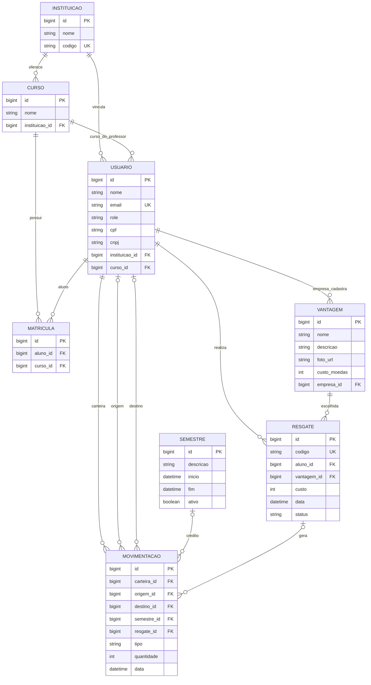

# DER — MeritCoin

```mermaid
erDiagram
  INSTITUICAO ||--o{ CURSO : oferece
  INSTITUICAO ||--o{ USUARIO : vincula
  CURSO ||--o{ MATRICULA : possui
  USUARIO ||--o{ MATRICULA : aluno
  CURSO ||--o{ USUARIO : curso_do_professor
  USUARIO ||--o{ VANTAGEM : empresa_cadastra
  USUARIO ||--o{ MOVIMENTACAO : carteira
  USUARIO o|--o{ MOVIMENTACAO : origem
  USUARIO o|--o{ MOVIMENTACAO : destino
  SEMESTRE o|--o{ MOVIMENTACAO : credito
  USUARIO ||--o{ RESGATE : realiza
  VANTAGEM ||--o{ RESGATE : escolhida
  RESGATE o|--o{ MOVIMENTACAO : gera

  INSTITUICAO {
    bigint id PK
    string nome
    string codigo UK
  }
  CURSO {
    bigint id PK
    string nome
    bigint instituicao_id FK
  }
  USUARIO {
    bigint id PK
    string nome
    string email UK
    string role
    string cpf
    string cnpj
    bigint instituicao_id FK
    bigint curso_id FK
  }
  MATRICULA {
    bigint id PK
    bigint aluno_id FK
    bigint curso_id FK
  }
  SEMESTRE {
    bigint id PK
    string descricao
    datetime inicio
    datetime fim
    boolean ativo
  }
  VANTAGEM {
    bigint id PK
    string nome
    string descricao
    string foto_url
    int custo_moedas
    bigint empresa_id FK
  }
  MOVIMENTACAO {
    bigint id PK
    bigint carteira_id FK
    bigint origem_id FK
    bigint destino_id FK
    bigint semestre_id FK
    bigint resgate_id FK
    string tipo
    int quantidade
    datetime data
  }
  RESGATE {
    bigint id PK
    string codigo UK
    bigint aluno_id FK
    bigint vantagem_id FK
    int custo
    datetime data
    string status
  }
```
